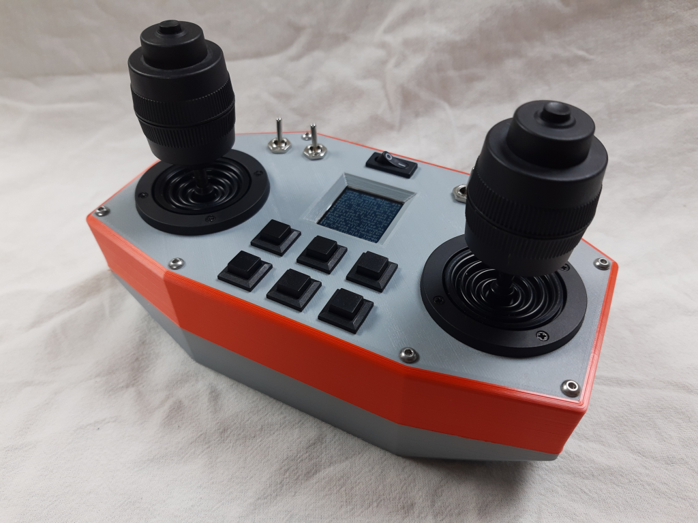
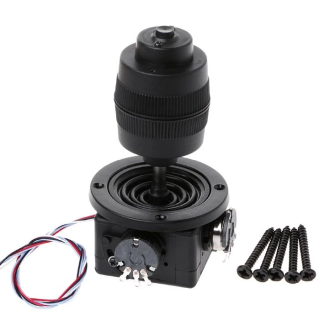
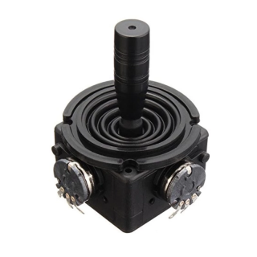
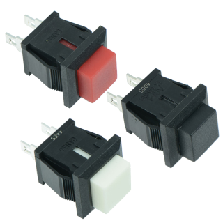
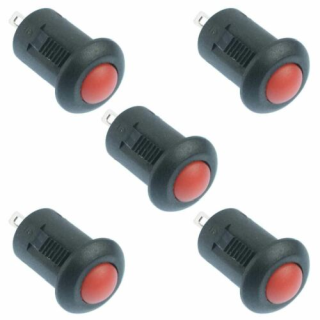
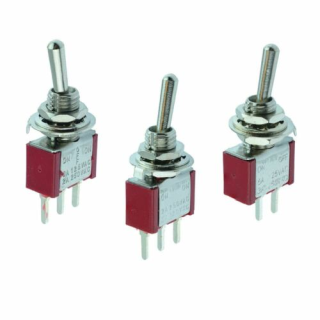
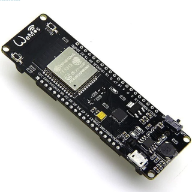
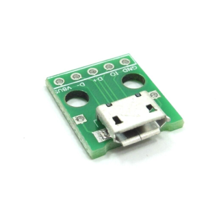
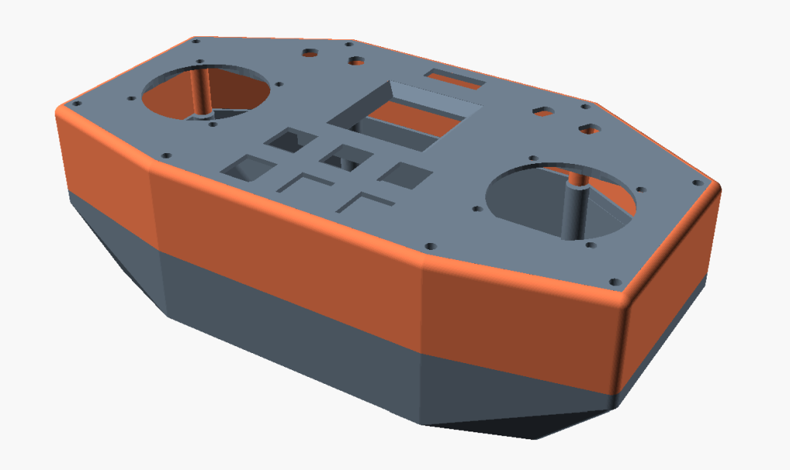

# Sticky
Sticky is a 3D printed remote control handset for robotics projects. It uses an **ESP32** and 2.4Ghz Wi-Fi/ESP-Now for communication rather than conventional remote control RX/TX hardware.

The intention is that Sticky can interact directly with the computers involved in robotics projects rather than connecting a game controller etc. to a computer.

The communication method might be MQTT, some kind of Websockets API, or through use of MicroROS to talk to ROS directly. This project is very much an early work in progress so software support is initially minimal, with an expectation people will roll their own as every robotics project is different. My initial focus will be on my m2mDirect Arduino library to connect to another Espressif ESP8266/ESP32, which is how I'm currently controlling my projects.

The design is 3D printable on common hobbyist 3D printers in whatever material you fancy. PLA works fine.

Sticky uses all the GPIO on an ESP32, without multiplexing, to provide plenty of buttons and switches for your project.

## Supported joysticks

The expected joystick are the **JH-D400X-R4 3-axis**, or alternatively the **JH-D202X-R4 2-axis** or equivalents. Both fit the same mounting space. Ideally use the R4 models as they have 10k potentiometers.

When wiring, ensure there are 3.9k resistors in series at both the ground and VCC connection for the joystick axes. This moves sticks' the working area into the the supported range of the ADCs on the ESP32 and makes it more linear.

## Supported switches

Through variant top panels, different switch types can be supported. You need four toggle SPST on/off miniature toggle switches and six 'normally open' momentary switches. Switches of similar size can be used with careful use of a file or knife to open the holes out. These sizes are pretty common so easy to get hold of and you may already have some.

### Variant 1

- One **on/off rocker 'power' switch**, **20x7mm** cut-out
- Four **miniature toggle switches**, **6mm** 'keyed' cut-out
- Six **'square' momentary NO buttons**, **12.4 x11mm** cut-out

### Variant 2

- One **on/off rocker 'power' switch**, **20x7mm** cut-out
- Four **miniature toggle switches**, **6mm** 'keyed' cut-out
- Six **round momentary NO buttons**, **8mm** cut-out

### Example square buttons

### Example round buttons

### Example toggle switches

## Supported screen

The current supported screen is the [1.44" Adafruit 128x128](https://www.adafruit.com/product/2088) TFT display. Support for other screens would be simple in software but contingent on access to them to accommodate them in the 3D printed design.

## Suggested development boards

You should use an ESP32 development board with onboard battery charging/protection, power switch and that exposes as many GPIO as possible as Sticky can use all the main GPIO on an ESP32.

I used a "**WEMOS WiFi & Bluetooth Battery**" board like the one below then carefully de-soldered the on/off switch and 18650 battery holder to fit external connections.

You will also need a small micro-USB breakout to connect from the development board to the charge/programming connector on your development board.

I am considering doing a small run of custom boards designed specifically to support Sticky that allow for a more optimised case design.

## Wiring/pinout

You can wire Sticky however you wish, but here's the pinout I've used in my prototype and will put in any code I share. It broadly follows the order of the GPIO on and ESP32 WROOM module.

### Joysticks

When wiring the joysticks, on each axis add 3.9K or similar value resistors to both 'ends' of each potentiometer in series with their connections to 3.3v and GND. Then connect the 'wiper' to the following GPIO.

- **Left stick X** - GPIO **36**
- **Left stick Y** - GPIO **39**
- **Left stick Z** - GPIO **34**
- **Right stick X** - GPIO **35**
- **Right stick Y** - GPIO **32**
- **Right stick Z** - GPIO **33**

### Toggle switches

Connect one terminal to GND and then the other terminal to the following GPIO.

- **Toggle A** - GPIO **25**
- **Toggle B** - GPIO **26**
- **Toggle C** - GPIO **27**
- **Toggle D** - GPIO **14**

### Buttons

Connect one terminal to GND and then the other terminal to the following GPIO.

- **Button 1 (top of left stick)** - GPIO **12**
- **Button 2 (top of right stick)** - GPIO **13**
- **Button 3** - GPIO **15**
- **Button 4** - GPIO **2**
- **Button 5** - GPIO **0**
- **Button 6** - GPIO **4**
- **Button 7** - GPIO **16**
- **Button 8** - GPIO **17**

### Screen

- **MOSI** - GPIO **23**
- **MISO** - GPIO **19**
- **SCK** - GPIO **18**
- **TFT CS** - GPIO **5**
- **Reset** - GPIO **22**
- **D/C** - GPIO **21**
- **Light** - **3.3v**
- Card CS - unused

### Power switch

Replace the onboard power switch from your dev board with connections to the power switch.

### USB breakout

Use one of the widely available cheap micro-USB breakouts like the one pictured. It's designed to be a tight fit in the hole as the socket on these rips off quite easily and being snugly fit in the case will help support it.

As the intention is to be flexible on which dev board you use and how you fix it in the case, you just cut a micro USB cable to an appropriate length and then strip and solder the leads to this breakout. You may need to trim the cable strain relief with a knife to make it easier to fit.

## 3D printing

You should print the three parts in the default orientation. The base and upper section need supports, the fascia does not. As these are large pieces, helping adhesion with a 'skirt' should be done to help resist warping.

Printing in standard PLA is fine. The top section and fascia are separate to allow for different combinations of buttons without a full reprint and also to allow the parts to be printed in contrasting colours.

## Assembly

As different people will use different dev boards and batteries, the base has no specific mounting points and I would expect you to use double sided adhesive pads or glue to hold things in place. There should be ample space for the board, battery and wiring, which is why the design is quite large.

I have used a 1500mAh recycled disposable vape battery, any LiPo of similar capacity or greater should be fine. If your board does decent power path management you should also be able to use Sticky while charging or powered by a larger power bank.

The micro-USB breakout should fit tightly in the hole at the rear of the controller and can be held with glue or some small self-tapping screws.

You will need 16x M4x30 (or longer) bolts to assemble the three main parts. These will self-tap into the top section. It was not designed for heat set inserts as it is not expected you will disassemble this many times, once assembled.

## Code

To make Sticky accessible to the largest number of hobbyists, the code targets the Arduino IDE. You need the [Arduino ESP32 core](https://github.com/espressif/arduino-esp32) and for the screen the Adafruit [GFX](https://github.com/adafruit/Adafruit-GFX-Library) and [ST7735](https://github.com/adafruit/Adafruit-ST7735-Library) libraries for the display. It's likely development will move to using higher performance display libraries and LVGL but these suffice for testing and basic display.

- GPIOtest - a simple sketch to check all the GPIO is connected properly to the sticks, switches and buttons

## Changelog

- 0.1 - Very first release of STLs, document and basic code

